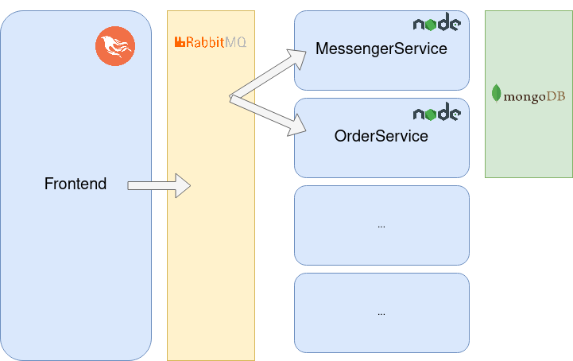

# Microservices with RabbitMQ - Playground Test app
Example app with simple microservices implementation using RabbitMQ.

## Tools
- Elixir (Phoenix Framework)
- Javascript (NodeJS)
- RabbitMQ
- MongoDB
